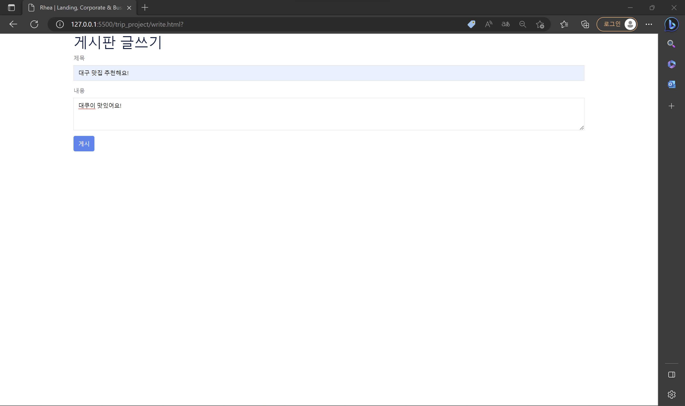

============================================================================
1. 메인화면
1-1) 검색 : 시/군/구와 검색하고자 하는 여행컨텐츠를 설정해서 검색 할 수 있다.

1-2) Photo Card : 사진을 클릭하면 해당 여행지의 위치와 정보를 볼 수 있다.

2. 관광지 정보 조회
2-1) 지도에서 검색 지역의 여행지를 목적에 맞게 조회할 수 있다.

2-2) 메인 화면에서 사진을 클릭하면 해당 여행지의 기본 정보(위치..)를 조회할 수 있다.

3. 로그인/회원관리 
3-1) 로그인
	3-1-1) 가입된 ID와 password로 로그인 할 수 있다.
	3-1-2) ID 혹은 password가 맞지 않으면 경고창을 띄운다.

	3-1-3) 로그인에 성공하면 성공 메시지를 띄우고 main화면으로 이동한다.

3-2) 회원가입 + 회원가입 성공 화면 캡쳐

	3-2-1) id : 중복되지 않은 id만 가입할 수 있다.

	3-2-2) id, pw, email, name, age를 모두 입력해야 회원가입이 가능하다.

3-3) 마이페이지
	3-3-1) 회원의 기본 정보를 조회할 수 있다.

	3-3-2) 회원의 기본 정보를 수정할 수 있다.

	3-3-3) 회원 탈퇴할 수 있다.

4. 게시판
	4-1 ) 로그인 하지 않은 회원은 글을 작성할 수 없다.

	4-2) 로그인 한 회원은 글 작성이 가능하다.

	4-3) 글 수정이 가능하다

	4-4) 글 삭제가 가능하다.

